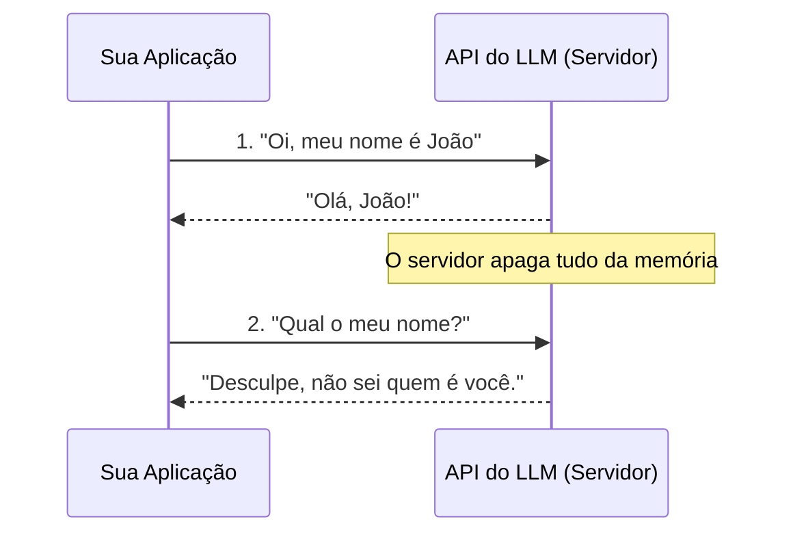
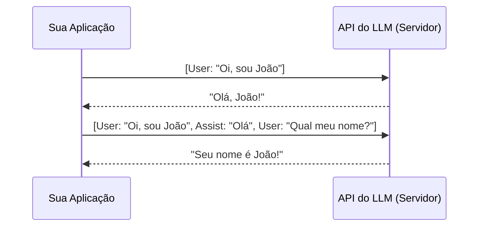
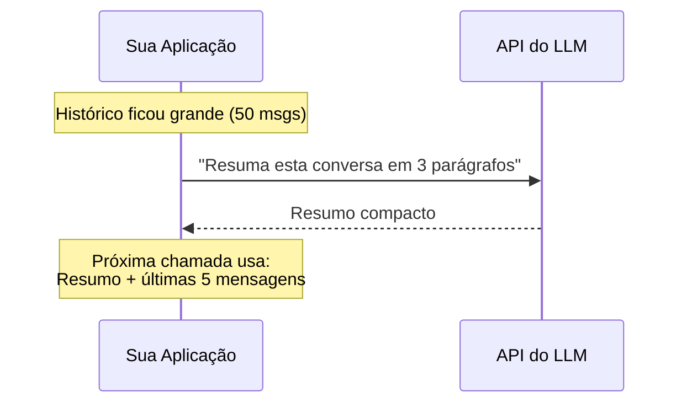
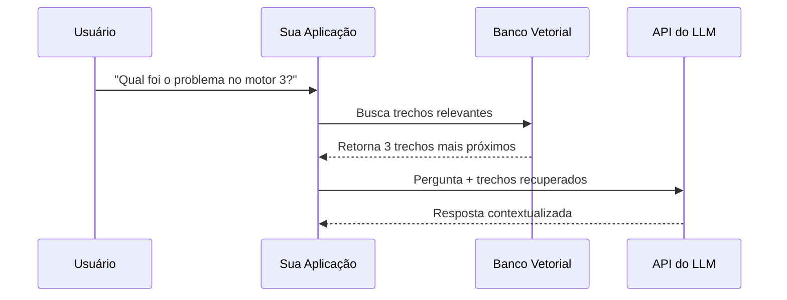

# Arquitetura de sistemas reais com IA
### *Introdução!*

 

**Slides:**
`github.com/pedromatumoto/ia-na-pratica`

---

## Quem sou eu?

**Pedro Matumoto**
* Engenheiro de Computação recém-formado pelo Instituto Mauá de Tecnologia com minor de Bioengenharia
* **Background:** Fiz parte da Mauá JR, Kimauanisso, dei monitoria de projetos também! Pra fechar, fiz um TCC sobre robótica autônoma doméstica.
* Hoje em dia trabalho com engenharia e arquitetura de software e IA com grandes quantidades de dados, mas sou apaixonado por robótica.
* **Foco atual:** Arquitetura de Software, Inteligência Artificial e Machine Learning.

<figure style="text-align: center;">
    
</figure>

---

## Onde estamos e para onde vamos?

**O cenário atual**

**O problema:**
Usar a interface web é fácil. Mas para poder utilizar em **sistemas reais** isso não basta. Como nós transformamos essa tecnologia e construímos algo robusto? Como um sistema corporativo usa IA sem expor dados e sem custar uma fortuna?

**O objetivo do curso:**
1. Mostrar que IA não é só ficar usando chat na Web.
2. Entender os limites técnicos das APIs de LLM.
3. Aprender a arquitetar sistemas reais ao redor desses modelos.

---
## 1. A Lente da IA: Como as máquinas enxergam o mundo?

Antes de falarmos de ChatGPT e texto, precisamos entender uma regra fundamental: **toda IA é, no fundo, um tradutor matemático**.

* O mundo real é analógico, contínuo e cheio de nuances.
* O mundo da IA é discreto, finito e estritamente **numérico**.

Para uma IA entender qualquer coisa, nós precisamos primeiro converter o mundo físico em matrizes de números.

---

## 2. Diferentes IAs, Diferentes "Olhos"

Dependendo do problema que queremos resolver, construímos "olhos" diferentes para a máquina:

* **Visão Computacional (Robótica / Carros Autônomos):** A IA não vê um semáforo ou um pedestre. Ela enxerga tensores — grades tridimensionais de pixels (matrizes de cores RGB) e busca padrões numéricos de contraste que formam bordas.
* **Séries Temporais (Machine Learning Tradicional):** Pensem nos dados de um motor de carro, ou de qualquer planta industrial. Para prever uma falha ou otimizar um sistema, a IA enxerga o mundo como um fluxo contínuo de arrays numéricos (velocidade, temperatura, aceleração) ao longo do tempo — o mesmo tipo de sinal que vocês de Automação já monitoram em malhas de controle.

<figure style="display:flex; gap:20px; justify-content:center;">

  

    
    <figcaption>Fonte: IA Expert</figcaption>
  

  

    
    <figcaption>Fonte: Mario Filho</figcaption>
  

</figure>

---

## 3. E a Linguagem Humana?

Nós sabemos traduzir a foto de um cachorro em pixels. Sabemos traduzir o motor de um carro em dados numéricos. **Mas como transformamos "ideias", "sarcasmo" e "conversa" em matemática?**

É exatamente para resolver esse problema que nasceram os **LLMs (Large Language Models)**.

---

## 4. Como um LLM enxerga o mundo?

* LLMs (Large Language Models) são, na sua essência, motores de probabilidade.
* Eles recebem um texto (Prompt) e preveem a próxima palavra (Token).
* Em uma conversa, não existe memória verdadeira como a humana. A LLM sempre tem que retomar o contexto inteiro.

*(Token = pedaço de palavra ou palavra inteira; é a "unidade" que o modelo processa e paga por vez — vamos voltar nisso mais pra frente.)*

---

## 5. O Paradigma Stateless (Sem Estado)

Assim como o protocolo HTTP original (o "idioma" que seu navegador usa pra conversar com sites), as APIs de LLM são **Stateless**.

* **O que isso significa?** A requisição 2 não sabe absolutamente nada sobre a requisição 1.
* Não existe "memória" nativa no servidor do modelo.
* Cada chamada à API deve conter **toda** a informação necessária para a resposta.

---

## 6. Porque funciona assim?

**Vantagens:**
* Altamente escalável (fácil balanceamento de carga — distribuir requisições entre vários servidores, já que nenhum precisa "lembrar" de nada).
* Menor uso de recursos no servidor.
* Previsibilidade: a mesma entrada tende a gerar saídas muito similares.

**Desvantagens:**
* Impossível manter uma conversa contínua sem intervenção.
* "Zero awareness" do que foi feito um segundo atrás.

---

## 7. A Ilusão da Memória: Entra o Contexto

Se o modelo não tem memória, como o ChatGPT lembra do meu nome?

* **A resposta:** A interface do usuário (o cliente ou o backend da sua aplicação) é quem gerencia o estado.
* Nós reenviamos o histórico da conversa a cada nova mensagem.

---
## 🤔 Pergunta pra vocês

**Qual é o grande problema arquitetural de reenviar o histórico inteiro a cada mensagem?**

---

## 8. O Custo do Contexto e a Janela de Tokens

* **Tokens:** a unidade de medida do LLM — pedaços de palavras que o modelo lê e gera.
* **Janela de Contexto (Context Window):** o limite máximo de tokens que o modelo consegue processar de uma vez (ex: 8k, 128k, 1M, 2M).

**O Gargalo da Arquitetura:**
1. **Financeiro:** você paga por token enviado (Input). Históricos longos = requisições caras.
2. **Latência:** mais contexto = mais tempo de processamento.
3. **Atenção:** modelos tendem a esquecer ou ignorar informações no "meio" de contextos gigantes (*Lost in the Middle*).

<figure style="text-align: center;">
  
  <figcaption style="text-align: center;">Fonte: <a href="https://miro.medium.com/1*QVXvydRMEWTWiUP42bYBAg.png">Medium</a></figcaption>
</figure>

---

## 9. Arquiteturas para Gestão de Contexto

Como arquitetos de software, não podemos apenas jogar texto infinito no modelo. Precisamos de estratégias. Vamos ver três das mais usadas na prática:

---

**a) Janela deslizante (Sliding Window)**
Mantém só as últimas N mensagens, descartando as mais antigas. Simples e barato, mas perde informação de conversas longas.

---

**b) Sumarização de histórico**
Periodicamente, o próprio LLM é usado para resumir a conversa até ali. Em vez de reenviar 50 mensagens, reenviamos um resumo de 3 parágrafos + as últimas trocas recentes.

---

**c) RAG (Retrieval-Augmented Generation)**
Em vez de guardar tudo no histórico, guardamos as informações em um banco de dados externo (geralmente um **banco vetorial**). A cada nova pergunta, buscamos só os pedaços de informação relevantes para aquela pergunta específica e injetamos no prompt — e é aqui que entram os **embeddings**, que vamos ver a seguir.

---

---
## 12. Embeddings: Como o computador entende a "vibe"?

Para o RAG funcionar, precisamos transformar texto em números através de **Embeddings**.

Imagine um mapa. Cidades parecidas ficam na mesma vizinhança.

O Embedding pega uma frase e dá a ela uma "coordenada GPS" em um espaço matemático.

Ideias parecidas ficam fisicamente próximas umas das outras — e é comparando essas "coordenadas" (com distância matemática) que o banco vetorial do slide anterior decide quais trechos são relevantes pra sua pergunta.

<figure style="text-align: center;">
  
  <figcaption style="text-align: center;">Fonte:  <a href="https://corpling.hypotheses.org/files/2018/04/Screen-Shot-2018-04-25-at-13.21.44.png">Around the word</a>
  </figcaption>
</figure>

---

## 🤔 Pra vocês

Se vocês fossem construir um assistente de IA para responder perguntas sobre **os manuais técnicos de uma fábrica inteira** (milhares de páginas), qual das três estratégias do slide 9 vocês usariam? Por quê?

---

## 13. Conclusão: O Papel do Engenheiro/Desenvolvedor

Trabalhar com LLMs não é só "fazer prompts legais". É projetar sistemas robustos:

* O LLM é apenas o motor de raciocínio lógico (o processador).
* A sua arquitetura é que deve fornecer a memória (RAM) e os arquivos (Disco).
* **Stateless** é a regra do modelo. O **Contexto** é a responsabilidade do sistema que você constrói ao redor dele.

---

## O que vem por aí

Hoje vimos os fundamentos: como a IA enxerga o mundo, por que ela é stateless, e as estratégias básicas de gestão de contexto (sliding window, sumarização, RAG).

Nas próximas aulas: API na prática com controle de custo, Structured Outputs com validação, Mini-RAG com busca semântica, pipelines com Pandas e extração de arquivos complexos até fechar em um produto com Streamlit.

---

## Dúvidas e Discussão Aberta

* Perguntas?
* Ideias de projetos que vocês gostariam de construir usando LLMs?

Obrigado pela atenção!
